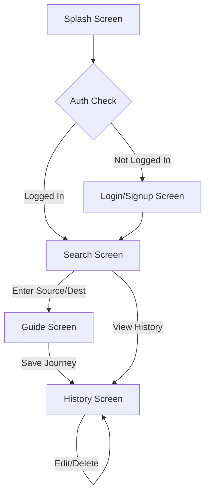

# Lab 2: Wireframing & App UI Flow Planning

## 1. User Interface Flow
The application follows a logical progression for a travel assistant:

## 2. Screen Descriptions

### Search Screen (Source/Destination)
- Simple, elegant inputs for starting point and end point.
- "Find My Way" button with micro-animations.

### Guide Screen (The Timeline)
- A vertical timeline showing:
    - Taxi from Source to Station.
    - Train details (Number, Time, Fare).
    - Taxi from Station to Final Destination.
- Visual cues like icons (Car, Train, Walk) and distance markers.

### Authentication (Login/Signup)
- Clean, focused UI for user entry.
- Validation for email and password fields.

### History Screen (CRUD)
- List of saved journeys.
- Each item can be tapped to re-view, edited for notes, or deleted.
